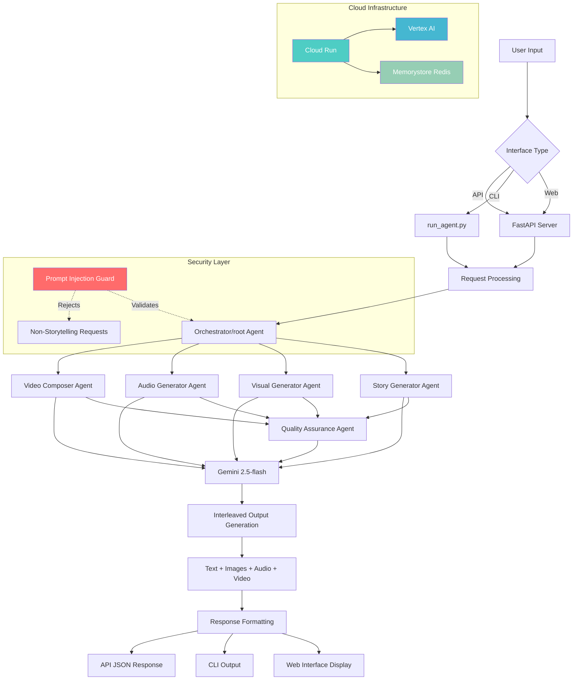
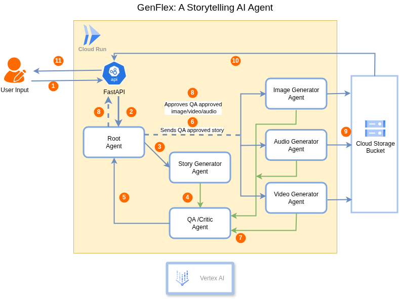

# GenFlex Creative Storyteller AI Agent


**Google AI Hackathon 2026 - Creative Storyteller Category**

A multimodal AI agent that creates engaging stories with interleaved text, images, audio, and video using Gemini's native capabilities. Built with Google ADK and deployed on Google Cloud.

## Features

- **Multimodal Storytelling**: Seamlessly weaves text, images, audio, and video in single fluid output
- **Family-Friendly Content**: All stories are appropriate for all ages with positive themes and wholesome narratives
- **Security First**: Prompt injection protection ensures storytelling-only behavior
- **Multi-Agent Architecture**: Specialized agents for orchestration, story generation, visuals, audio, video, and quality assurance
- **Token Usage Tracking**: Comprehensive monitoring and logging of API token consumption with session and cumulative statistics
- **Cloud-Native**: Deployed on Google Cloud with Vertex AI, Cloud Run, and Memorystore
- **Infrastructure as Code**: Terraform-based deployment with automated CI/CD

## Token Usage Tracking

The application includes comprehensive token usage monitoring to track Gemini API consumption:

- **Real-time Tracking**: Monitors token usage for each agent operation
- **Session & Cumulative Stats**: Tracks both current session and total lifetime usage
- **Model Breakdown**: Statistics by Gemini model (gemini-2.5-flash, gemini-2.5-pro, etc.)
- **Persistent Logging**: Saves usage data to local files or Google Cloud Storage
- **API Endpoints**: REST endpoints for retrieving usage statistics and resetting counters

### Token Tracking API

```bash
# Get current usage statistics
GET /api/token-stats

# Reset session counter
POST /api/reset-session
```

## Application Flow


## Application Diagram


## Quick Start

This section guides you through setting up and running the GenFlex Creative Storyteller locally using the CLI or a web interface.

### 1. Prerequisites

*   **Git:** For cloning the repository.
*   **Python 3.10 - 3.13:** Ensure Python is installed (specifically versions 3.10, 3.11, 3.12, or 3.13).
*   **uv:** Python package manager - [Install](https://docs.astral.sh/uv/getting-started/installation/)
*   **Google Cloud SDK:** For authentication and interacting with GCP services. Critical for image and audio generation. - [Install](https://cloud.google.com/sdk/docs/install)
*   **Docker (Optional):** If you prefer to run the application in a Docker container.
*   **Terraform (Optional):** Only required if you plan to deploy to Google Cloud.

### 2. Google Cloud Authentication & API Setup

The agent relies on Google Cloud services (Vertex AI for image/video generation, Gemini API for audio). You need to authenticate and enable necessary APIs.

```bash
# Authenticate with Google Cloud
gcloud auth login
gcloud auth application-default login

# Set your Google Cloud Project ID
# Replace 'your-project-id' with your actual Google Cloud Project ID
gcloud config set project your-project-id

# Enable required APIs
gcloud services enable aiplatform.googleapis.com \
                     run.googleapis.com \
                     redis.googleapis.com \
                     texttospeech.googleapis.com \
                     storage.googleapis.com # Storage is needed for media persistence
```

#### Cloud Run Source Deployment Permissions

If you encounter `AccessDeniedException: 403 HttpError` during Cloud Run deployment using `--source .` (e.g., via `make deploy-cloudrun`), it's likely due to the Cloud Build service account lacking permissions to access the internal staging bucket. Follow these steps to grant the necessary permissions:

1.  **Get your Google Cloud Project Number:**
    Replace `YOUR_PROJECT_ID` with your actual project ID.
    ```bash
    gcloud projects describe YOUR_PROJECT_ID --format='value(projectNumber)'
    ```

2.  **Grant Storage Object Admin Role:**
    Replace `YOUR_PROJECT_ID` and `YOUR_PROJECT_NUMBER` with your actual values. The `BUCKET_NAME` will be dynamically generated by Cloud Run based on your project and region.
    ```bash
    export PROJECT_ID="YOUR_PROJECT_ID"
    export PROJECT_NUMBER="YOUR_PROJECT_NUMBER"
    export CLOUD_BUILD_SA="${PROJECT_NUMBER}@cloudbuild.gserviceaccount.com"
    export BUCKET_NAME="run-sources-${PROJECT_ID}-us-central1" # Adjust region if needed

    gcloud storage buckets add-iam-policy-binding "gs://${BUCKET_NAME}" \
      --member="serviceAccount:${CLOUD_BUILD_SA}" \
      --role="roles/storage.objectAdmin"
    ```
    This grants the Cloud Build service account the `Storage Object Admin` role on the Cloud Run source bucket, allowing it to manage deployment artifacts.


### 3. Local Development

1.  **Clone the repository & navigate:**
    ```bash
    git clone https://github.com/your-username/genflex.git # Replace with your repo URL
    cd genflex
    ```

2.  **Install Python dependencies:**
    ```bash
    uv sync
    ```

3.  **Set environment variables:**
    These variables are crucial for the agent to function correctly. Replace `your-project-id` with your actual Google Cloud Project ID.
    ```bash
    export GEMINI_MODEL="gemini-2.5-flash"
    export GOOGLE_CLOUD_PROJECT="your-project-id"
    export GOOGLE_CLOUD_LOCATION="us-central1" # Or your preferred region
    export LOGS_BUCKET_NAME="genflex-local-media-bucket" # A temporary bucket for local media, if GCS persistence is desired
    # For local testing without GCS, LOGS_BUCKET_NAME can be omitted, media will be stored in static/media/
    ```
    *Note: For image and video generation, you need a Google Cloud Project with billing enabled and the necessary APIs enabled as described above.*

4.  **Run the application:**

    *   **Via CLI (Command Line Interface):**
        ```bash
        python run_agent.py
        ```
        Type prompts like: `Tell me a short story about a brave knight and include an image of a dragon.`
        The CLI will stream back text and media URIs.
        *   **Logging:** By default, logs go to `logs/run_agent.log`.
            *   To customize: `python run_agent.py --log-file logs/my_log.log`
            *   To disable file logging: `python run_agent.py --log-file ""`

    *   **Via Web Interface (FastAPI):**
        ```bash
        uvicorn app.fast_api_app:app --reload
        ```
        Open `http://localhost:8080` in your browser.

### 4. Running with Docker Locally (Alternative)

This provides an isolated environment for running the agent.

1.  **Build the Docker image:**
    ```bash
    docker build -t genflex-storyteller:latest .
    ```

2.  **Run the Docker container:**
    Use this single-line command, replacing `your-project-id` and ensuring `GOOGLE_APPLICATION_CREDENTIALS` points to your Google Cloud credentials file.
    ```bash
    docker run -it -p 8080:8080 \
    -v "$HOME/.config/gcloud/application_default_credentials.json:/tmp/adc.json:ro" \
    -v "$(pwd)/static/media:/app/static/media" \
    -e GOOGLE_APPLICATION_CREDENTIALS=/tmp/adc.json \
    -e GOOGLE_CLOUD_PROJECT=$PROJECT_ID \
    -e GOOGLE_CLOUD_LOCATION=us-central1 \
    -e GEMINI_MODEL=gemini-2.5-flash \
    -e GOOGLE_GENAI_USE_VERTEXAI=true \
    -e LOGS_BUCKET_NAME=your-bucket-name \
    genflex-storyteller:latest
    ```
    Open `http://localhost:8080` in your browser once the container starts.

    > **Note:** If you see `exec: "-v": executable file not found in $PATH`, the command was split across lines incorrectly. Always run it as a single unbroken line.

## Architecture

### Multi-Agent System
- **Orchestrator Agent**: Coordinates the storytelling pipeline
- **Story Generator Agent**: Creates narrative content and structure
- **Visual Generator Agent**: Generates images and visual scenes
- **Audio Generator Agent**: Creates voice narration and sound effects
- **Video Composer Agent**: Combines visuals with audio into video segments
- **Quality Assurance Agent**: Validates content quality and coherence

### Technology Stack
- **AI**: Gemini 2.5-flash with interleaved output
- **Framework**: Google ADK (Agent Development Kit)
- **Backend**: FastAPI with async processing
- **Frontend**: HTML/CSS/JavaScript
- **Infrastructure**: Google Cloud (Cloud Run, Vertex AI, Memorystore)
- **Deployment**: Terraform + Docker

## Project Structure

```
genflex/
├── app/                    # Core application code
│   ├── agent.py           # Main storyteller agent with security
│   ├── orchestrator_agent.py    # Pipeline coordinator
│   ├── story_generator_agent.py # Narrative creation
│   ├── visual_generator_agent.py # Image generation
│   ├── audio_generator_agent.py # Audio content
│   ├── video_composer_agent.py  # Video composition
│   ├── quality_assurance_agent.py # Content validation
│   ├── multi_agent_app.py # Multi-agent orchestration
│   ├── fast_api_app.py    # REST API server
│   └── app_utils/         # Utilities and helpers
├── static/                # Web interface assets
│   └── index.html        # Main web application
├── infrastructure/        # Infrastructure as Code
│   ├── main.tf          # Terraform configuration
│   └── README.md        # Deployment guide
├── docs/                  # Documentation
│   ├── plan.md          # Development roadmap
│   ├── architecture.md  # System architecture
│   ├── constitution.md  # Code principles
│   └── specification.md # Detailed requirements
├── tests/                 # Test suites
├── prompts/              # Hackathon requirements
├── logs/                 # Application logs
├── .copilot/            # AI workspace notes
└── pyproject.toml       # Dependencies
```

## API Usage

### Generate a Story
```bash
curl -X POST "http://localhost:8080/story" 
  -H "Content-Type: application/json" 
  -d '{"prompt": "Tell me a story about a robot who discovers emotions"}'
```

### Response Format
```json
{
  "parts": [
    {
      "text": "Once upon a time...",
      "mime_type": "text/plain"
    },
    {
      "text": "[Generated image: robot with expressive face]",
      "mime_type": "image/jpeg"
    },
    {
      "text": "[Audio narration: 'The robot felt something new...' in emotional voice]",
      "mime_type": "audio/mpeg"
    }
  ]
}
```

## Deployment

### Automated Deployment
```bash
cd infrastructure
terraform init
terraform plan -var="project_id=your-project-id"
terraform apply -var="project_id=your-project-id"
```

### Google Cloud Run Deployment (Makefile Direct)

The easiest way to deploy the GenFlex web interface and its backend is using Google Cloud Run. This approach automatically packages the application from source and manages all necessary environment variables.

1. Ensure your Google Cloud Project is set:
   ```bash
   gcloud config set project your-project-id
   ```

2. Run the deployment command via Make:
   ```bash
   make deploy-cloudrun
   ```

This command automatically executes `gcloud run deploy --source .` and pushes the exact environment configuration required for the agents to function seamlessly (including `LOGS_BUCKET_NAME=genflex-bucket-agenticdemos`).

Once deployed, Google Cloud Run will provide you with a public URL where you can access the GenFlex Creative Storyteller web interface!

### Google Cloud Run Deployment (Terraform Managed)

For a more Infrastructure-as-Code approach, you can deploy the Cloud Run service using Terraform. This method involves manually building and pushing the Docker image to Artifact Registry, then letting Terraform manage the Cloud Run service deployment.

**Prerequisites:**

*   Your Google Cloud Project ID: `YOUR_PROJECT_ID`
*   Google Cloud Region: `YOUR_REGION` (e.g., `us-central1`)
*   Artifact Registry Repository Name: `YOUR_ARTIFACT_REGISTRY_REPO_NAME` (e.g., `genflex-storyteller-repo`)

**Steps:**

1.  **Set environment variables (in your shell):**
    ```bash
    export PROJECT_ID=\"YOUR_PROJECT_ID\"
    export REGION=\"YOUR_REGION\"
    export REPOSITORY_NAME=\"YOUR_ARTIFACT_REGISTRY_REPO_NAME\"
    export IMAGE_NAME=\"genflex-storyteller\"
    export IMAGE_TAG=\"latest\"
    ```

2.  **Navigate to the `genflex` application directory:**
    ```bash
    cd /genflex
    ```

3.  **Build the Docker image:**
    ```bash
    docker build -t ${REGION}-docker.pkg.dev/${PROJECT_ID}/${REPOSITORY_NAME}/${IMAGE_NAME}:${IMAGE_TAG} .
    ```

4.  **Push the Docker image to Artifact Registry:**
    *   Ensure the Artifact Registry API is enabled:\
        ```bash
        gcloud services enable artifactregistry.googleapis.com
        ```
    *   Create the Artifact Registry repository (if it doesn\'t exist, this will be handled by Terraform in the next step, but you can also create it manually):\
        ```bash
        gcloud artifacts repositories create ${REPOSITORY_NAME} --repository-format=docker --location=${REGION} --description=\"Docker repository for GenFlex Storyteller\"
        ```
    *   Configure Docker to authenticate to Artifact Registry:\
        ```bash
        gcloud auth configure-docker ${REGION}-docker.pkg.dev
        ```
    *   Push the image:\
        ```bash
        docker push ${REGION}-docker.pkg.dev/${PROJECT_ID}/${REPOSITORY_NAME}/${IMAGE_NAME}:${IMAGE_TAG}\
        ```

5.  **Deploy with Terraform:**
    *   Navigate to the Terraform infrastructure directory:\
        ```bash
        cd /home/nulledgenerd/Documents/Practice/agentic-ai/demos/demo-1/genflex/infrastructure
        ```
    *   Initialize Terraform (if not already done for this directory after recent changes):\
        ```bash
        terraform init
        ```
    *   Apply the Terraform changes to deploy the Cloud Run service and ensure the Artifact Registry repository is created:\
        ```bash
        terraform apply -var=\"project_id=${PROJECT_ID}\" -var=\"region=${REGION}\"\
        ```

After successful deployment, Terraform will output the `cloud_run_url` of your deployed service.

## Session Persistence with Redis (Future Work)

Currently, the agent uses `InMemorySessionService`, which means conversation history is lost if the Cloud Run instance restarts or scales. To enable persistent conversations, you need to integrate Memorystore (Redis) for session management.

**Goal:** Persist agent conversation history using the provisioned Memorystore (Redis) instance.

**Steps to Implement:**

1.  **Create a `RedisSessionService`:** Implement a custom class (e.g., in `app/app_utils/redis_session_service.py`) that adheres to the `google.adk.sessions.SessionService` interface. This class will use the `redis_client` (already initialized in `app/fast_api_app.py`) to store and retrieve session data.

    *   You will need to define methods like `create_session`, `get_session`, `update_session`, and `delete_session` that interact with Redis keys to store serialized conversation turns.

2.  **Update `app/fast_api_app.py`:** Modify the `Runner` initialization to use your new `RedisSessionService` instead of `InMemorySessionService`.
    ```python
    # Example modification in app/fast_api_app.py
    # from .app_utils.redis_session_service import RedisSessionService # Import your new service
    # ...
    # runner = Runner(root_agent, RedisSessionService(redis_client=redis_client))
    ```

3.  **Rebuild and Redeploy:** After making these code changes, rebuild your Docker image and redeploy your Cloud Run service. Refer to the "Google Cloud Run Deployment (Terraform Managed)" section for detailed steps on building, pushing the Docker image, and applying Terraform.

    *   **Note:** The `REDIS_HOST` and `REDIS_PORT` environment variables are already being passed to your Cloud Run service by the existing Terraform configuration, so your `RedisSessionService` can directly access them via `os.getenv()`.

## Testing

```bash
# Run all tests
uv run pytest

# Run with coverage
uv run pytest --cov=app --cov-report=html

# Run specific test categories
uv run pytest tests/unit/
uv run pytest tests/integration/
```

## Security

- **Prompt Injection Protection**: Agent restricted to storytelling only
- **Input Validation**: All user inputs validated and sanitized
- **Authentication**: Google Cloud IAM integration
- **Audit Logging**: Comprehensive logging for compliance

## Monitoring

### Health Checks
```bash
# API health endpoint
curl http://localhost:8080/health

### Health Checks
```bash
# API health endpoint
curl http://localhost:8080/health

# Application metrics
# Available at /metrics endpoint (when deployed)
```

### Logs
```bash
# View application logs
gcloud logging read "resource.type=cloud_run_revision AND resource.labels.service_name=genflex-storyteller"

# Local logs
tail -f logs/run_agent.log
```

## Contributing

1. Fork the repository
2. Create a feature branch
3. Make your changes
4. Add tests for new functionality
5. Submit a pull request

# Some Troubleshooting Tips 
## Verify tag the key exists on project
gcloud resource-manager tags keys list --parent=projects/PROJECT_ID

## Create the tag value
gcloud resource-manager tags values create Development 
    --parent=PROJECT_ID/environment

## Create separate API keys for each service (best practice)
### 1. Developer Knowledge API key
gcloud services api-keys create 
    --project=PROJECT_ID 
    --display-name="DK API Key" 
    --api-target=service=developerknowledge.googleapis.com

## 2. Generative Language API key
gcloud services api-keys create 
    --project=PROJECT_ID 
    --display-name="Generative Language API Key" 
    --api-target=service=generativelanguage.googleapis.com

## List keys to get their IDs and values
gcloud services api-keys list --project=PROJECT_ID

## Enable MCP server
gcloud beta services mcp enable developerknowledge.googleapis.com 
    --project=PROJECT_ID

### Add DK MCP to gemini (use the DK API key)
```
gemini mcp add -t http -H "X-Goog-Api-Key:DK_API_KEY" google-developer-knowledge https://developerknowledge.googleapis.com/mcp --scope user
```

## More on local developement

This repository powers the **GenFlex Creative Storyteller** built for the Gemini Live Agent Challenge. The demo emphasizes Gemini's interleaved multimodal output and can be interacted with locally or via HTTP.

### Local CLI
Run a quick conversation from the terminal:

```bash
source .venv/bin/activate && uv sync
```

```bash
python run_agent.py
```

By default this writes logs to `logs/run_agent.log`. To customize:

```bash
python run_agent.py --log-file logs/my_log.log
```

You can also set `LOG_FILE` to change the default log path without passing a flag:

```bash
export LOG_FILE="logs/my_log.log"
python run_agent.py
```

To disable file logging entirely, pass an empty string:

```bash
python run_agent.py --log-file ""
```

Type prompts such as:

```
> Tell me a short story about a dragon and include an image of the dragon
```

The CLI will stream back text and any inline media instructions.

### HTTP API
Start the FastAPI server (requires `uvicorn`):

```bash
uvicorn app.fast_api_app:app --host 0.0.0.0 --port 8080
```

Then request:

```bash
curl -X POST localhost:8080/story \ 
  -H 'Content-Type: application/json' 
  -d '{"prompt": "Create a story about a robot playground"}'
```

### Deployment Proof
Deploy to Google Cloud (Agent Engine, Cloud Run, etc.) and capture a short recording of
console logs or service dashboard for hackathon submission. Make sure the backend
calls Vertex AI/ADK and uses Memorystore as described in the plan.

## Deploy to Agent Engine

Vertex AI Agent Engine hosts the agent as a managed, scalable backend. The UI is the [Vertex AI Console Playground](https://console.cloud.google.com/vertex-ai/agents) — no separate frontend needed.

### Prerequisites

```bash
gcloud auth login
gcloud auth application-default login
gcloud config set project YOUR_PROJECT_ID

# Enable required APIs
gcloud services enable aiplatform.googleapis.com storage.googleapis.com texttospeech.googleapis.com --project YOUR_PROJECT_ID
```

### 1. Provision infrastructure (bucket + IAM)

```bash
cd infrastructure
terraform init
terraform apply -var="project_id=YOUR_PROJECT_ID"
cd ..
```

### 2. Set environment variables

```bash
export GOOGLE_CLOUD_PROJECT=YOUR_PROJECT_ID
export GOOGLE_CLOUD_LOCATION=us-central1   # or your preferred region
export LOGS_BUCKET_NAME=genflex-bucket
```

### 3. Deploy

```bash
make deploy
```

This will:
- Export Python dependencies to `app/app_utils/.requirements.txt`
- Package and upload `./app` to Agent Engine
- Print a Console Playground URL on success, e.g:
  ```
  📊 Open Console Playground: https://console.cloud.google.com/vertex-ai/agents/locations/us-central1/agent-engines/<ID>/playground?project=YOUR_PROJECT_ID
  ```
- Write the Agent Engine resource ID to `deployment_metadata.json`

To update an existing deployment, run `make deploy` again — it detects the existing agent by display name and updates it in place.

### 4. Pass environment variables to Agent Engine

```bash
make deploy 
  EXTRA_ARGS="--set-env-vars=GOOGLE_CLOUD_PROJECT=YOUR_PROJECT_ID,GOOGLE_CLOUD_LOCATION=us-central1,LOGS_BUCKET_NAME=genflex-bucket,GEMINI_MODEL=gemini-2.5-flash"
```

Or edit the `deploy` target in `Makefile` to add `--set-env-vars` permanently.

### Media files

Generated images and audio are stored in `gs://genflex-bucket/media/`. Video generation (Veo) also outputs there. You can browse files via:

```bash
gsutil ls gs://genflex-bucket/media/
```

```bash
gcloud services enable aiplatform.googleapis.com --project YOUR_PROJECT_ID
```

Then deploy:

```bash
gcloud config set project <your-project-id>
make deploy
```

To set up your production infrastructure, run `uvx agent-starter-pack setup-cicd`.
See the [deployment guide](https://googlecloudplatform.github.io/agent-starter-pack/guide/deployment) for details.


## Observability

Built-in telemetry exports to Cloud Trace, BigQuery, and Cloud Logging.
See the [observability guide](https://googlecloudplatform.github.io/agent-starter-pack/guide/observability) for queries and dashboards.
